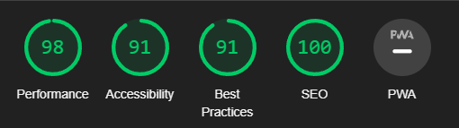

# Ten-Forward
Developer : Jamie Phelps

[](https://ten-forward-53badab24b10.herokuapp.com/)


# Table of Content

1. [Project Description](#project-description)
2. [Project Goals](#project-goals)
    1. [User Goals](#user-goals)
    2. [Site Owner Goals](#site-owner-goals)
3. [User Experience](#user-experience)
    1. [Target Audience](#target-audience)
    2. [User Requirements and Expectations](#user-requirements-and-expectations)
    3. [User Stories](#user-stories)
4. [Design](#design)
    1. [Design Choices](#design-choices)
    2. [Colour](#colour)
    3. [Fonts](#fonts)
    4. [Wireframes](#wireframes)
5. [Technologies Used](#technologies-used)
    1. [Languages](#languages)
    2. [Frameworks & Tools](#frameworks-&-tools)
6. [Features](#features)
    1. [Existing Features](#existing-features)
    2. [Future Features](#future-features)
7. [Testing](#validation)
    1. [HTML Validation](#HTML-validation)
    2. [CSS Validation](#CSS-validation)
    3. [Accessibility](#accessibility)
    4. [Mock up](#mock-up)
    5. [Performance](#performance)
    6. [Device Testing](#performing-tests-on-various-devices)
    7. [Browser Compatibility](#browser-compatability)
8. [Bugs](#Bugs)
9. [Deployment](#deployment)
10. [Credits](#credits)
11. [Acknowledgements](#acknowledgements)

# Project Description
This project is a website for a restaurant that has a Star Trek theme, delivering food and drink that was taken from the TV shows. On this website you can view the menus, contact the restaurant, make an account and book a table with them.

# Project Goals

## User Goals
* To create a table booking,
* To be able to view, edit and cancel bookings,
* To view menus and contact info.

## Site Owner Goals
* To provide a solution to allow users to book a table online,
* To attract more business with a well crafted site,
* Provide a modern application with an easy navigation.

# User Experience

## Target Audience
* Users that wish to book a table for a meal or a party with family and friends,
* Past and new customers for the business,
* Tourists visiting the area that are looking for a meal, a drink or both,
* Fans of the show.

## User Requirements and Expectations
* Accessible
* A welcoming design
* Contact information
* Accessibility

## User Stories

1. As a first time user I can navigate the site so that I can find the page I'm looking for,
2. As a first time user I can use the footer so that I can access the socials,
3. As a user I can make a booking at a desired time and date so that I can reserve a table,
4. As a user I can visit the about us page so that I can find out information about the restaurant,
5. As a user I can view the restaurant opening times and contact details so that I know when it will be open and how to contact them,
6. As a user I can go to the booking page so that I can make a booking,
7. As a user I can edit my booking so that I can change the time and date I choose,
8. As a user I can edit my booking so that I can delete my booking,
9. As a new user I can go to the registration section so that so I can register with the restaurant,
10. As a user I can go to the login page so that I can login into the site,
11. As a user I can see my login status so that I can tell whether or not I'm logged in,
12. As a user I can see the menus so that I can decide what to have at the restaurant,
13. As an Admin or Authorised User I can login so that I can access the back end of the site,
14. As an Admin I can add a manual booking so that I can add a booking if someone books in person or through email,
15. As an Admin I can edit the menus so that I can change what the restaurant offers,
16. As an Admin I can set up custom error pages so that if there is problem the page is displayed.


### Kanban & User Stories

* GitHub Kanban was used to track all open user stories
* Todo, In Progress, Done headings were used in the kanban


# Design

## Colour
At first I wanted to use the Star Trek uniform colours as the colour scheme for the site but after checking them in a accessibility program I found that they would be unsuitable to use. I therefore choose this colour pallet to work from to make the experience better for the user.


## Fonts


# Structure

## Database
<details>
<summary>Database Diagram</summary>
<br>
 
</details>

## Food Model
The Food Model contains the following:
* food_id
* food_name
* description
* price
* available

## Drink Model
The Drink Model contains the following:
* drink_id
* drink_name
* description
* price
* available

## Table Model
The Table Model contains the following:
* table_id (PrimaryKey)
* table_name
* max_seats

## Booking Model
The Booking Model contains the following:
* booking_id (PrimaryKey)
* created_date
* requested_date
* requested_time
* table (ForeignKey)
* user (ForeignKey)
* status
* seats
* guest_count

## ContactUs Model
The ContactUs Model contains the following:
* message_id (PrimaryKey)
* created_date 
* user (ForeignKey)
* name (ForeignKey)
* email (ForeignKey)
* message


## Wireframes
<details>
<summary>Home</summary>
<br>
 
</details>

<details>
<summary>About Us</summary>
<br>
 
</details>

<details>
<summary>Menus</summary>
<br>
 
</details>

<details>
<summary>Drinks/Food</summary>
<br>
 
</details>

<details>
<summary>Contact Us</summary>
<br>
 
</details>

<details>
<summary>Booking</summary>
<br>
 
</details>

# Technologies Used
## Languages
* HTML
* CSS
* Python
* Django

## Frameworks & Tools
* Git
* GitHub
* GitPod
* Bootstrap
* Balsamiq
* Google Fonts
* Font Awesome
* Favicon.io
* W3S Tutourials
* Heroku Platform
* Chrome dev tools


# Features
## Existing Features
### Favicon


 

### Navbar


### Footer


### About Us


### Booking


### Contact Us


### Food/Drinks


### Home


### My Bookings


### Sign Up


## Future Features
In the future I would like to be able to include a blog where users can add comments to posts that have been made. It would also be nice to improve the look and feel of the site so that it was a little bit more star trek themed and adding more photos of the food and drinks.

# Validation
I put my website through the following validation tools:

### HTML Validation


### CSS Validation


### Performance
#### Booking


#### Contact Us


#### Drinks


#### Food


#### Home


#### Login



#### My Bookings


#### Menu


### Device testing
* IPhone XS Max
* IPad Pro
* HP Laptop 
* HP Desktop

All pages have also been tested on all available screen sizes on google chrome dev tools.

### Browser Compatibility
Google Chrome
Microsoft Edge

## Bugs
A lot of my time bug fixing on this project has been spent on fixing issues to do with deployment to Heroku and linking to the Elephant database once deployed.


# Deployment

### Local Deployment

In order to make a local copy of this project, you can clone it. In your IDE Terminal, type the following command to clone the repository:

- `git clone https://github.com/Thephelpster/CI_PP4_TF`

If done locally, the virtual environment needs to be created and activated. To do so, in your IDE Terminal, type the following commands:
```
python3 -m venv venv
```

If on Linux/MacOS, type the following command for activation:
```
source venv/bin/activate
```
On Windows type the following command for activation:
```
venv\Scripts\activate
```

***

After cloning or opening the repository in Gitpod, you will need to:

1. Create your own `.env` file in the root level of the project:

```
SECRET_KEY=[your_secret_key]
DEBUG=True
DATABASE_URL=postgres://[username]:[password]@[host]:[port]/[database_name]
```
**Ensure the `.env` file is added to your `.gitignore` file so it doesn't get pushed to a public repository.

2. Run `pip3 install -r requirements.txt` to install required Python packages.

3. Migrate the database models using:
`python3 manage.py migrate`

4. Create a superuser with your own credentials:
`python3 manage.py migrate`

5. Run the Django server:
`python manage.py runserver`
The address of the server will appear in the terminal window.
Add /admin to the address to access the Django admin panel using your superuser credentials.

### Heroku Deployment

Sign up to [Heroku](https://heroku.com/) for free if you don't already have an account.

1. Create a new app in Heroku.

2. In the Resources tab of your app in the Heroku dashboard, click Add-Ons and select Heroku Postgres. Select Hobby Dev - Free as your plan.

3. When Heroku Postgres is installed, click the Settings tab in the Heroku Dashboard.
Click Reveal Config Vars, and add the same variables from your `.env` file here, except for `DEBUG`, as you don't want debug mode on the deployed project.

4. Copy the value of `DATABASE_URL` from the Config Vars. In your `settings.py` file, comment out the default database configuration, and add a new one with the Postgres url.

```
DATABASES = {
    'default': dj_database_url.parse('your DATABASE_URL here'),
}
```

5. Migrate the database models using:
`python3 manage.py migrate`

6. Create a superuser with your own credentials:
`python3 manage.py migrate`

7. Create a file called `Procfile` (no extension) containing the following:
```
web: gunicorn core.wsgi
```

8. Run `pip3 install -r requirements.txt` to install required Python packages.

9. Add the url of your Heroku app ('https://ten-forward-53badab24b10.herokuapp.com/') to your `settings.py` file:

```
ALLOWED_HOSTS = [
    'ten-forward-53badab24b10.herokuapp.com',...
]
```

10. Disable collect static so that Heroku doesn't try to collect static files when you deploy by adding the following to your Heroku Config Vars in the Settings tab of Heroku dashboard:

```
DISABLE_COLLECTSTATIC=1
```

The same variable has to be removed from Heroku Config Vars when you want to collect static files (for the testing and final deployment).

11. Stage and commit your files to GitHub
```
git add . 
git commit -m "Commit message"
git push
```

12. In the Heroku dashboard for your App, select Deploy.
Under Deployment Method, choose GitHub and search for your repository and click Connect.

13. Select Enable Automatic Deployments, and then Deploy Branch. Heroku will build the App from the branch you selected.

14. Now whenever you push your commits to GitHub, Heroku will rebuild the application.

### Forking the GitHub Repository
The project can be forked in order to make a copy of the original repository and propose changes to the project owner using Pull Requests.
This can be done by following these steps:
First, log in to GitHub and locate the [Project's Repository](https://github.com/Thephelpster/CI_PP4_TF).
At the top of the Repository, on the right side of the page, locate the "Fork" button.
A copy of the Repository should now be in your GitHub account.
You can now propose changes to the Repository by creating a Pull Request.

### Live deployment
The web site is deployed on Heroku and can be found [here](https://ten-forward-53badab24b10.herokuapp.com/).


[Back to top ⇧](#table-of-contents)


# Credits
* [Code Institute](https://learn.codeinstitute.net)
* [Codemy](https://members.codemy.com)

## Content
Images and ideas relating to Star Trek are owned by Paramount and CBS
Descriptions of food and drinks comes from Memory Alpha


## Code and Design
* Colorspace - for the colour pallet


* Googlefonts - for the font styles


* Favicon.io - for converting the logo into a favicon
https://favicon.io/

* Font Awesome - for the social media fonts used in the footer
https://fontawesome.com/

# Acknowledgements
I'd like to thank these people who gave me all the help and support I needed to finish and make this project look as good as it does.

* Mo Shami, my mentor, for all the guidance, help and advice.
* Roman Rakic, who helped me get the project finished off when I was stressing out about not finishing in time.
* Tomislav Dukez, whos been very patient with helping me through the simplest of issues I've had and kept me going when I've wanted to quit, you're awesome!
* Kate Cleal, my partner, for designing the 400, 403, 404 and 500 page images and being my spell checker for all the text. She's also been my rock throughout this whole project giving me the time to be able to complete it.